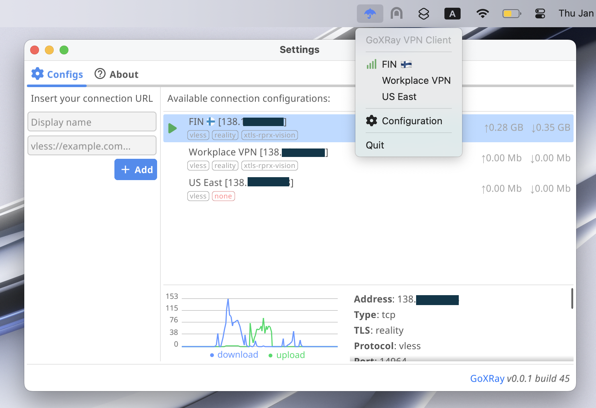

#  GoXRay: Desktop VPN client for XRay


[](https://goreportcard.com/report/github.com/goxray/desktop)

This project brings fully functional [XRay](https://github.com/XTLS/Xray-core) desktop client for macOS and Linux, powered by [fyne](https://github.com/fyne-io/fyne) and written in Go.

> [!NOTE]
> The program will not damage your routing rules, default route is intact and only additional rules are added for the lifetime of application's TUN device. There are also additional complementary clean up procedures in place.



#### What is XRay?
Please visit https://xtls.github.io/en for more info.

#### Tested and supported on:
- macOS (tested on Sequoia 15.1.1 M3)
- Linux (tested on Ubuntu 24.10 ARM)

> [!WARNING]
> Although the Linux version is tested, safe to use, and works as expected, it is not considered stable yet. There might be some GUI related issues (like tray menu updating delays).
> Please let me know if you have any troubles with the Linux version. If you encounter privileges issues make sure to check [#Linux](#linux) info below.
>
> Feel free to test this on your system and let me know in the issues :)

## ✨ Features
- Stupidly easy to use
- Adding and editing XRay URL configurations
- Supports all [Xray-core](https://github.com/XTLS/Xray-core) protocols (vless, vmess e.t.c.) using link notation (`vless://` e.t.c.)
- Real-time network statistics for each configuration
- Responsive, lightweight and dynamic UI, focusing on tray menu for quick and easy interactions
- Only soft routing rules are applied, no changes made to default routes

## ⚡️ Usage

### 🌐 VPN Client

#### macOS

> [!TIP]
> You can easily set the application to start at login.
> Go to `System Settings` > `General` > `Login Items & Extensions` > `Open at Login`, then press `+` and browse for GoXRay.app

Get the latest release app bundle from [Releases](https://github.com/goxray/desktop/releases) and... just run it.
You will be prompted for privileged access, and your GoXRay VPN is ready.
Don't forget to add the app to your `Applications` and `Open at Login` items!

#### Linux

There are some limitations on running GUI apps with elevated privileges on newer Linux distros. To run it on Ubuntu you should set some privileges and run it with the `sudo -E` prefix:

```bash
chmod u+s ./goxray
sudo -E ./goxray
```

### 🛠️ Building the project

> [!IMPORTANT]
> - `sudo` is required, the application will prompt you for privileged access when you run it.
> - CGO_ENABLED=1 is required.
> - Visit https://docs.fyne.io/started/ to get required dependencies for your platform.

If you have all the required dependencies in place for building the project. You can simply run:
```bash
CGO_ENABLED=1 go build . -o goxray
```

For Linux, you should also set additional privileges to run the binary, see [#Linux](#linux) info above.

If you want to get the macOS application bundle (.app structured file), you can run:
```bash
# go install fyne.io/fyne/v2/cmd/fyne@latest
fyne package -os darwin # Check out the newly created GoXRay.app file
```

### 📋 TODO
- [ ] Add logs tab with all std logs and export button
- [ ] Add rearranging items functionality
